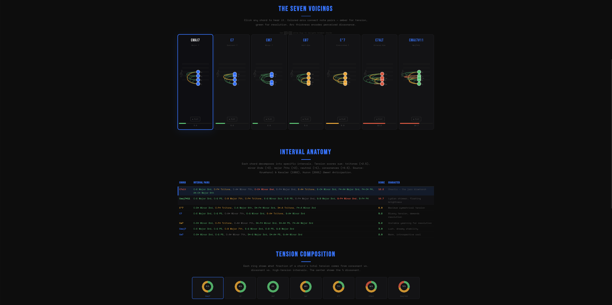

# Chord selection gets out of sync across the analysis views

I keep losing track of which chord I am actually looking at when I move between the voicing cards, Interval Anatomy, and Tension Composition.

Those three sections are different views of the same seven chords, so selecting a chord in any one of them should make that chord the single current selection everywhere. Right now I can choose one chord in the interval table, move to another chord elsewhere, and end up with different sections still indicating different chords.

The arrow-key navigation makes the mismatch more confusing. After I choose a chord from Tension Composition, pressing left or right should continue from that chord. Instead, after switching between sections, the arrow keys can jump from an older selection rather than the chord I just chose.

Please make selection handoffs consistent whether I use a voicing card, an Interval Anatomy row, a Tension Composition cell, or the left/right arrow keys. There should never be more than one chord presented as selected, and the interval row for the current chord should have a clear selected treatment just like the other analysis views. Keyboard activation of the selectable analysis controls should behave the same as clicking them.

The custom chord builder is separate from this navigation and should continue working normally.

