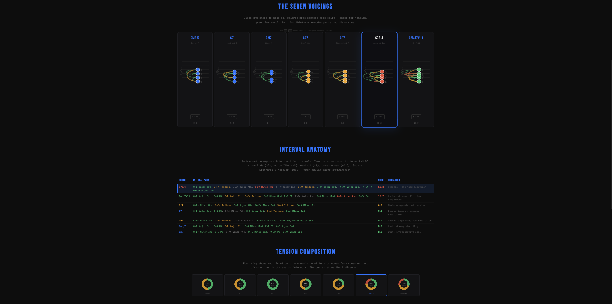

# Chord selection gets out of sync across the analysis views

Hey, I noticed the chord selection gets pretty confusing and buggy as you move between the different sections on the page.

When I click on C7alt inside the Interval Anatomy section, the voicing cards end up highlighting a completely different chord as selected, even though C7alt is clearly the row I just clicked. I ran into a similar issue after picking a chord in Tension Composition and then using the arrow keys to step through chords—instead of moving from the one I just chose, it jumps around and continues from some older chord I was looking at earlier.

The same thing happens in reverse: clicking a chord card in the voicings section can leave Interval Anatomy displaying something else entirely. The ranked rows in Tension Spectrum should also be selectable, but choosing one there must follow the chord label rather than its place in the ranking. Clicking a spectrum row or activating it with Enter or Space should update the other views, and the next arrow-key step should continue from that chord.

Moving through chords using the keyboard should feel just as consistent as clicking them with the mouse. Whichever chord I most recently picked—whether from a voicing card, Interval Anatomy, Tension Composition, Tension Spectrum, or the arrow keys—should be the one that stays actively selected across the entire page. The custom chord builder has been working fine through all of this, so that shouldn't be touched.

The broken app currently looks like this:

The expected app should look like this:

